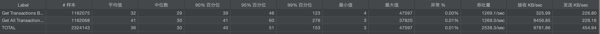
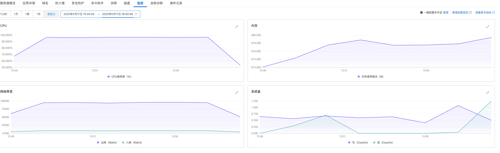

# 交易管理系统

## 1. 项目概述
这是一个基于 Spring Boot 的交易管理系统，提供用户交易记录的创建、查询、更新和删除功能。系统采用内存存储，支持缓存机制，并提供了完整的单元测试和性能测试。系统支持多种交易类型，包括存款、取款、转账、消费、收入、缴费和退款等。

### 1.1 访问应用
- 前端页面：http://47.117.104.229:8080/index.html
- Swagger API文档：http://47.117.104.229:8080/swagger-ui.html

### 1.2 部署环境
- 阿里云 2CPU1G Docker26.1.3

## 2. 技术栈
- Java 21
- Spring Boot 3.1.9
- Spring Data Commons
- Spring Cache
- Caffeine Cache
- Maven
- JUnit 5
- Mockito
- Lombok
- Vue 3
- Jmeter

## 3. 系统架构

### 3.1 主体结构说明
```
| 包名 | 职责| 
| --- | --- | 
| config | 系统配置类（Swagger、缓存） | 
| controller | REST API 控制器 | 
| dto | 数据传输对象 |
| enums | 枚举定义 |
| exception | 异常处理 |
| model | 实体类 |
| repository | 数据访问层 |
| service | 业务逻辑层 |
| resource | 前端页面和配置文件 |
| test | 单元测试代码和jmeter压力测试脚本 |

```

### 3.2 核心组件说明
1. **模型层 (Model)**
   - `Transaction`: 交易实体类
   - `TransactionType`: 交易类型枚举
   - `TransactionStatus`: 交易状态枚举，目前没有用到，后期扩展使用

2. **数据访问层 (Repository)**
   - `InMemoryTransactionRepository`: 内存存储实现
   - 使用 ConcurrentHashMap 确保线程安全

3. **服务层 (Service)**
   - `TransactionService`: 业务接口
   - `TransactionServiceImpl`: 业务实现
   - 实现缓存机制

4. **控制器层 (Controller)**
   - `TransactionController`: REST API 实现
   - 统一的异常处理

5. **前端实现**
   - 基于 Vue 3 和 Element Plus
   - 响应式设计
   - 支持分页和搜索

## 4. 数据实体说明

### 4.1 交易实体 (Transaction)
```java
public class Transaction {
    private String id;                    // 交易ID
    private String userId;                // 用户ID
    private BigDecimal amount;            // 交易金额
    private TransactionType type;         // 交易类型
    private String transactionSummary;    // 交易摘要
    private String counterpartyName;      // 交易对方名称
    private String counterpartyAccountNumber; // 交易对方账号
    private String description;           // 交易描述
    private LocalDateTime createdAt;      //交易创建时间
    private LocalDateTime updatedAt;      //交易更新时间
}
```

### 4.2 交易类型 (TransactionType)
```java
public enum TransactionType {
    DEPOSIT("存款", "将资金存入银行账户"),
    WITHDRAWAL("取款", "从银行账户中取出资金"),
    TRANSFER("转账", "将资金从一个账户转移到另一个账户"),
    EXPENSE("消费", "使用银行账户进行购物、支付等消费行为"),
    INCOME("收入", "收到的工资、奖金、利息等收入"),
    PAYMENT("缴费", "缴纳各种费用，如水电费、电话费、物业费等"),
    REFUND("退款", "收到的退款或退货款项");
}
```

## 5. API接口描述

### 5.1 创建交易
- **URL**: POST `/api/transactions`
- **请求体**: TransactionRequest
- **响应**: 201 Created (TransactionResponse)

### 5.2 查询交易
- **URL**: GET `/api/transactions/{id}`
- **响应**: 200 OK (TransactionResponse)

### 5.3 查询用户交易
- **URL**: GET `/api/transactions/user/{userId}`
- **响应**: 200 OK (List<TransactionResponse>)

### 5.4 查询所有交易（分页）
- **URL**: GET `/api/transactions?page=0&size=20`
- **响应**: 200 OK (Page<TransactionResponse>)

### 5.5 更新交易
- **URL**: PUT `/api/transactions/{id}`
- **请求体**: TransactionRequest
- **响应**: 200 OK (TransactionResponse)

### 5.6 删除交易
- **URL**: DELETE `/api/transactions/{id}`
- **响应**: 204 No Content

## 6. 缓存介绍

### 6.1 缓存配置
- 使用 Caffeine 作为缓存实现
- 缓存过期时间：10分钟
- 最大缓存条目：1000
- 启用缓存统计

## 7. 异常处理

### 7.1 自定义异常
- `TransactionNotFoundException`: 交易不存在
- `DuplicateTransactionException`: 交易ID重复
- `InvalidTransactionException`: 无效的交易数据

## 8. 测试覆盖

### 8.1 单元测试
1. **基本功能测试**
   - 创建交易
   - 查询交易
   - 更新交易
   - 删除交易

2. **缓存测试**
   - 缓存命中测试
   - 缓存失效测试
   - 缓存更新测试

3. **异常测试**
   - 参数验证
   - 业务规则验证
   - 异常处理验证

### 8.2 压力测试
- 使用 Jmeter 进行压力测试，按照使用场景，主要对按照userid查询和分页查询接口进行性能测试，提前用创建交易接口随机生成10000个交易数据
- 线程数 100，Ramp-up:60s, 执行时间15分钟

- 运行聚合报告

- 系统监控报告

## 9. 运行说明

### 9.1 本地运行
```bash
# 编译打包
mvn clean package

# 运行应用
java -jar target/bank-transaction-system-1.0-SNAPSHOT.jar
```

### 9.2 Docker运行
```bash
# 构建镜像
docker build -t bank-transaction-system:1.0 .

# 运行容器
docker run -d \
  --name bank-transaction \
  -p 8080:8080 \
  -e JAVA_OPTS="-Xms512m -Xmx512m" \
  --restart always \
  bank-transaction-system:1.0
```

## 10. 待优化点

### 10.1 功能优化
- 添加交易金额验证规则
- 实现交易状态流转机制

### 10.2 性能优化
- 优化缓存策略
- 添加监控和告警

### 10.3 安全优化
- 添加数据加密
- 实现审计日志

### 10.4 可用性优化
- 添加服务降级
- 实现限流机制 